# Photon-Box
Simulation of quantum feedback methods to stabilize photon-number states.

## Introduction

Our goal is to **control the number of photons** inside a cavity. Atoms are repeatedly sent through the cavity, where they interact with the photons. Measuring their state gives some information on the cavity, and makes it possible to compute which control to apply. We say the cavity is the **system** (S) and the atom is the **meter** (M).

The cavity is modelled by a **quantum harmonic oscillator**. Its Hamiltonian can be written as a function of the pulsation of the cavity, and the annihilation and creation operators:

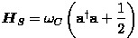


The atoms are modelled by **two-state systems**. Their Hamiltonian can be expressed as a function of the difference in pulsation between the excited and ground states using the Pauli operators:

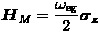


The Hamiltonian of the **composite system**, which also takes into account the entanglement of the system and the meter, is of the form:

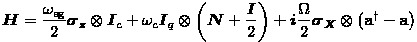

We will work in the **dispersive approximation**:

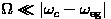. 

In this case, the composite Hamiltonian is given by the simpler expression:

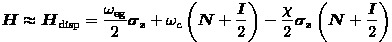

where:

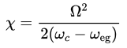.

## The Open Loop apparatus

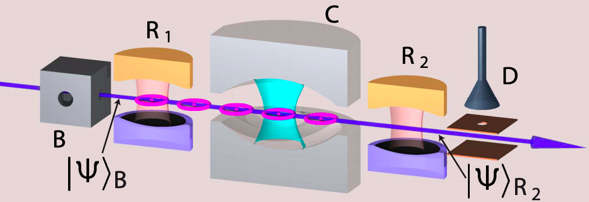


An atom leave the box **B**, where it has been prepared in its ground state. Initially the cavity is in a coherent state such that the mean number of photons corresponds to the Fock state we want to stabilize. The state of the composite system is then given by:

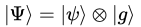

The atom then traverse a first cavity **R<sub>1</sub>**. Next, it passes through **S** where it interacts with the photons: this is where the state of the composite system becomes entangled. The atom then travel through one last cavity **R<sub>2</sub>**. Finally, its state is measured in a field-ionization detector **D**.

The evolution of the composite system between the release of an atom from **B** and the moment before it is measured is summed up in the Schrödinger propagator **U<sub>SM</sub>**. The state of the full system after leaving **R<sub>2</sub>** is given by:

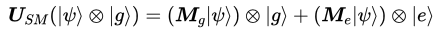

This formula defines the **measurement operators** **M<sub>g</sub>** and **M<sub>e</sub>**. Under the dispersive approximation, it can be shown that:

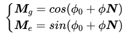

Following the measurement (hence the collapse of the wave function), the state of the composite system is:

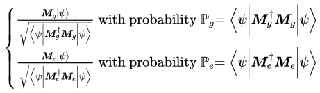

The previous paragraphs referred to the journey of a single atom through the apparatus. Repeating this process by continuously sending atoms yields a Markov Chain, defined at step k by:

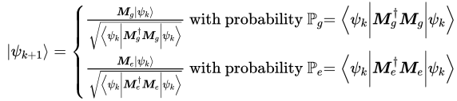

We will see in the next paragraph that due to mistakes in the measurement process, we have access only to probability distributions of states rather than pure states. The bra-ket formalism is therefore insufficient: we must use **density matrices**.

Given a pure state before measurement, the state after the measure is:

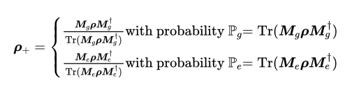

Hence the associated Markov Chain:

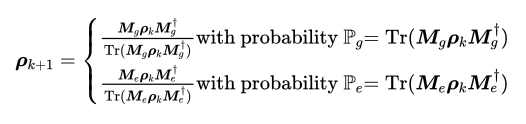

## Deviations from the previous model

This model is far from enough to describe the photon box experiment. Here are some of the elements it omits:

* We are interested in controlling the system, yet have not yet modelled the **effect of a control** on the cavity and atoms. 
* The detector **D** does not measure all of the atoms that pass through it: there is a probability that it **missed an atom**.
* The detector **D** sometimes gives **false measures**: there is a probability that it **made a mistake**.
* The cavity is not a perfect reflector: it may absorb photons. Some photons are also created due to thermal fluctuations. This **relaxation of the cavity** is described by the Lindlad equation.


Given a python file in this folder, the following table gives the corrections it does and doesn't includes. For instance, ```lindblad_control.py```  includes a control and takes the relaxation of the cavity into consideration via the Lindblad equation, but it does not account for delays, omissions and errors in the measurement process.


| Simulation                    | Control | Omit | Mistake | Relaxation |
| :---------------------------: |:-------:| :---:| :------:| :---------:|
| ```idealized_no_control.py``` |  No     | No   | No      | No         |
| ```idealized_control.py```    |  Yes    | No   | No      | No         |
| ```lindblad_control.py```     |  Yes    | No   | No      | Yes        |


## References
* Dotsenko et al., [Quantum feedback by discrete quantum non-demolition measurements:
towards on-demand generation of photon-number states](https://arxiv.org/pdf/0905.0114.pdf), 2009
* Amini et al., [Design of Strict Control-Lyapunov Functions
for Quantum Systems with QND Measurements](https://arxiv.org/pdf/1103.1365.pdf), 2011
* Amini et al., [Feedback stabilization of discrete-time quantum systems subject to
non-demolition measurements with imperfections and delays](https://arxiv.org/pdf/1201.1387.pdf), 2013
* Sayrin et al., [Real-time quantum feedback prepares and stabilizes
photon number states](https://arxiv.org/pdf/1107.4027.pdf), 2011
* Somaraju et al., [Semi-Global Approximate stabilization of an infinite
dimensional quantum stochastic system](https://arxiv.org/pdf/1103.1732.pdf), 2011

## License
This project is under the MIT license.
