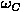
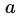
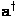
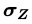
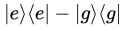
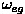
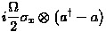
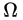

# Photon-Box
Simulation of quantum feedback methods to stabilize photon-number states.

## Context
Our goal is to **control the number of photons** inside a cavity. Atoms are repeatedly sent through the cavity, where they interact with the photons. Measuring their state gives some information on the cavity, and makes it possible to compute which control to apply. We say the cavity is the **system** (S) and the atom is the **meter** (M).

The cavity is modelled by a **quantum harmonic oscillator**, with Hamiltonian:

where:
*   is the pulsation of the cavity, 
*   is the photon annihilation operator, its adjoint 
 is the photon creation operator, and the product of the two is the number of photons in the cavity.

The atoms are modelled by **two-state systems**, with Hamiltonian:

where:
*   is the Pauli operator .

*   is the difference in pulsation between the excited and ground states.

The Hamiltonian of the **composite system** can be written:

where:
*  is the interaction Hamiltonian. 
*  is a constant.
 

We will work under the dispersive approximation:

. 

In this case, the  Hamiltonian is given by the simpler expression:

where 

.

## References
* Dotsenko et al., [Quantum feedback by discrete quantum non-demolition measurements:
towards on-demand generation of photon-number states](https://arxiv.org/pdf/0905.0114.pdf), 2009
* Amini et al., [Design of Strict Control-Lyapunov Functions
for Quantum Systems with QND Measurements](https://arxiv.org/pdf/1103.1365.pdf), 2011
* Amini et al., [Feedback stabilization of discrete-time quantum systems subject to
non-demolition measurements with imperfections and delays](https://arxiv.org/pdf/1201.1387.pdf), 2013
* Sayrin et al., [Real-time quantum feedback prepares and stabilizes
photon number states](https://arxiv.org/pdf/1107.4027.pdf), 2011
* Somaraju et al., [Semi-Global Approximate stabilization of an infinite
dimensional quantum stochastic system](https://arxiv.org/pdf/1103.1732.pdf), 2011

## License
This project is under the MIT License.
